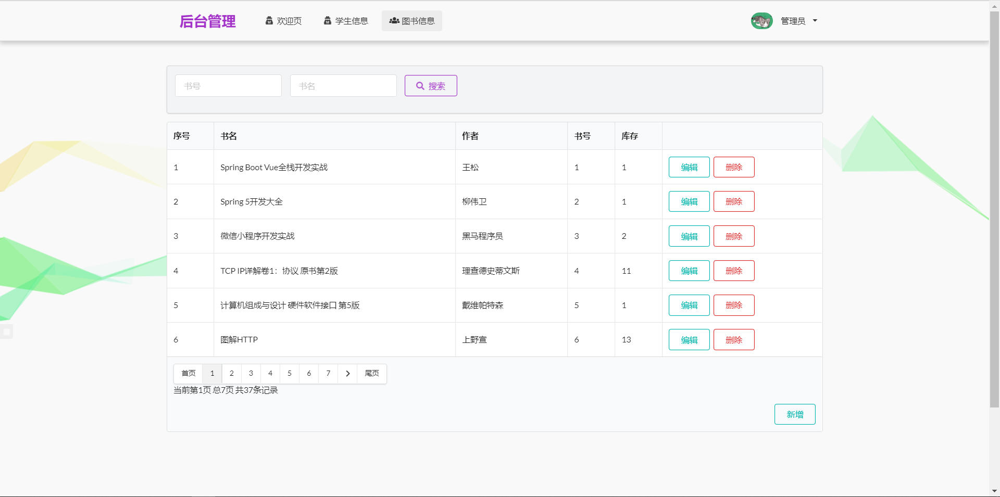
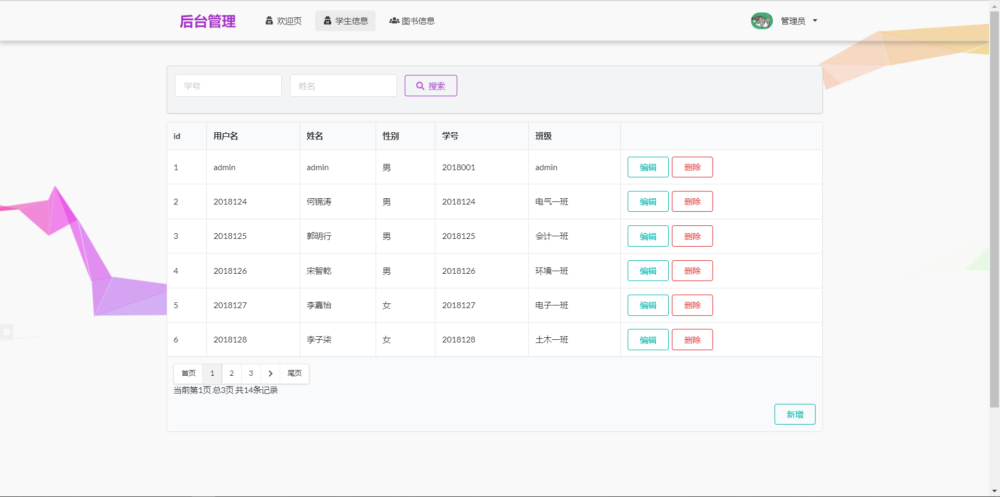
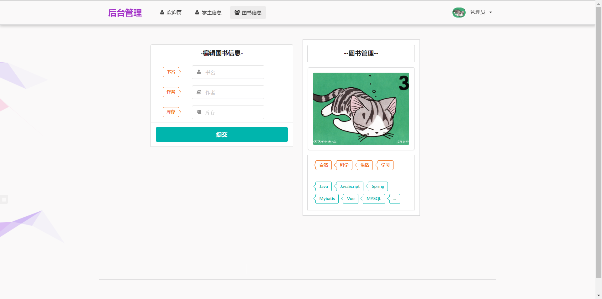

# 书籍借阅系统

#### 介绍
功能：用户：登录、注册、借阅、归还、消息反馈。管理员：管理图书、管理用户、管理反馈消息

#### 技术
Springboot + Mybatis + Spring Security + Semantic UI + Thymeleaf

#### 工具环境
JDK1.8

idea 2020.1

mysql 5.7.22

tomcat 9.0.54

maven 3.6.3

#### 项目截图

前台登录

注册

图书借阅

图书归还

反馈评论

修改个人信息

后台登录

管理书籍

管理用户

添加图书信息

